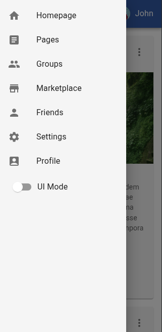
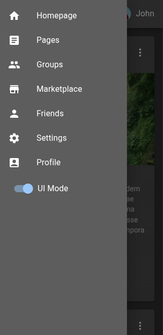

# ⚛️ Projeto Frontend de UI com React & MUI 🎨

### 💡 Propósito

Este projeto é um laboratório de experimentação com o Material UI (MUI) e React. A ideia principal é entender melhor os recursos do MUI, explorando sua integração com temas, tipografia e estilização de componentes. Além disso, foi implementado um sistema de light/dark mode utilizando Context API para gerenciamento global de tema.

### 🧰 Tecnologias e Conceitos Explorados
* **Material UI (MUI):** Biblioteca de componentes React com foco em design moderno e acessibilidade.
* **styled:** Utilizado para customizar componentes do MUI.
* **Typography:** Componente para manter a consistência visual dos textos na interface.
* **Temas customizados:** O projeto conta com arquivos próprios para gerenciar e modificar o tema da aplicação (`./src/theme/theme.js`), permitindo controle total sobre cores, etc.
* **Light/Dark Mode:** Implementação de alternância entre temas claro e escuro via Context API, com persistência local e fácil expansão para integração com backend futuramente.

### ✨ Demonstração

### 🚀 Funcionalidades em Destaque

* **Base de Páginas Estruturada:** Possibilidade de criar novas páginas com navegação intuitiva.
* **Componentes MUI:** Utilização dos componentes, modificação de alguns com `styled components`.
* **Temas Adaptáveis:** Implementação de Light e Dark mode, com possibilidade de alteração da paleta de cores no arquivo `./src/theme/theme.js`.
* **Interação com Posts (Visual):**
	* Botões de "Like" e "Compartilhar" com feedback visual ao clique
	* Botão de "Opções de Post" presente nos posts.
* **Navegação Lateral:** Barra lateral para facilitar o acesso às páginas principais.
* **Painéis de Informação:** Sessões estáticas de "Online Friends", "Latest Photos" e "Latest Conversations" para preencher a interface.
* **Gerenciamento de Usuário Simples:** Menu de usuário acessível no canto superior direito, com opções de Perfil, Conta e Logout (estrutura visual pronta).
* **Design Responsivo:** Layout adaptável a diferentes tamanhos de tela e dispositivos.
* **Criação Rápida de Conteúdo (Futuro Backend):** Botão "+" posicionado na parte inferior esquerda para a futura funcionalidade de adicionar novos posts.

### 📸 Capturas de Tela

#### ☀️ Modo Claro

#### 🌙 Modo Escuro

#### 📱 Responsividade (Exemplo em Dispositivo Móvel [320px])

#### 📱 Responsividade Sidebar (Exemplo em Dispositivo Móvel [320px])

#### 📱 Responsividade (Exemplo em Dispositivo Móvel [768px])

#### 💻 Responsividade (Exemplo em Desktop [1024px])

### 🧠 Considerações Finais
Este projeto continua sendo um espaço de aprendizado e testes com o ecossistema do React + Material UI. A ideia é explorar os recursos oferecidos pela biblioteca, testando padrões de design, responsividade, temas e boas práticas de UI/UX.

Novas funcionalidades e melhorias visuais serão adicionadas à medida que mais experimentos forem feitos. 🚀
