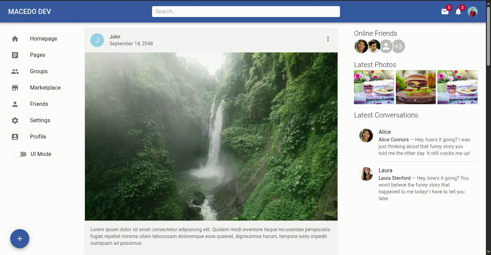
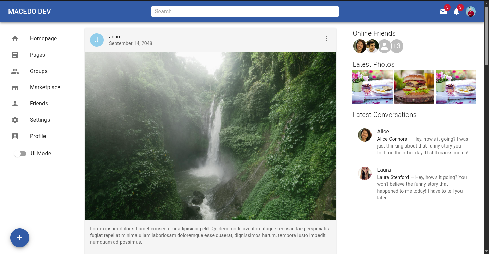
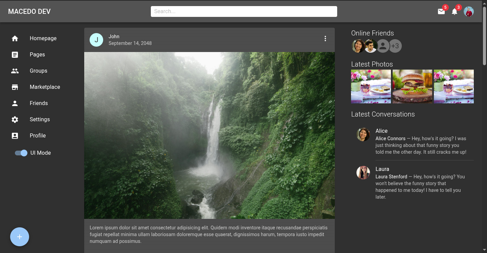
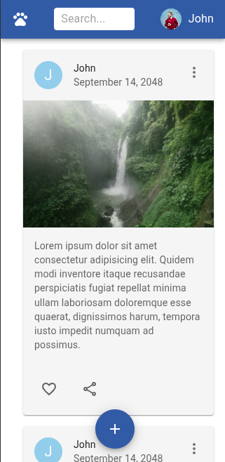
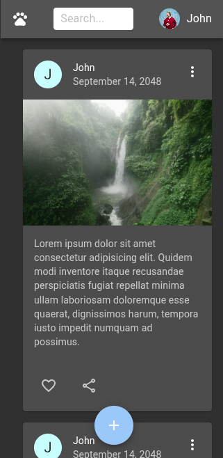
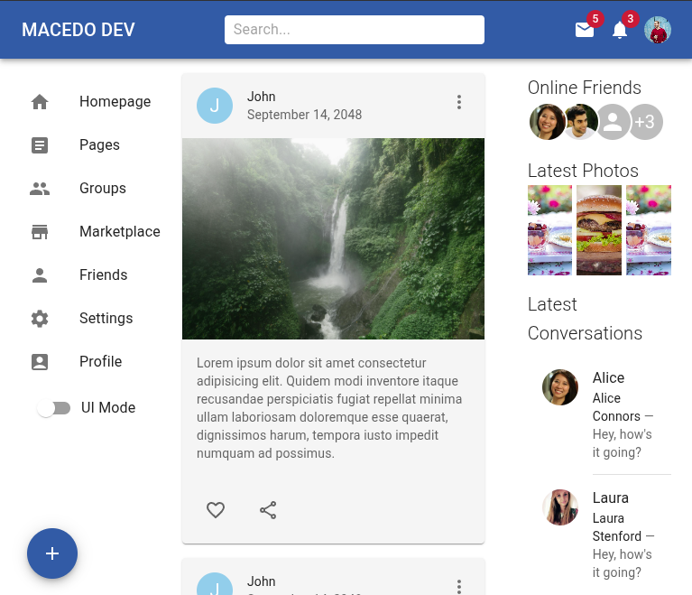
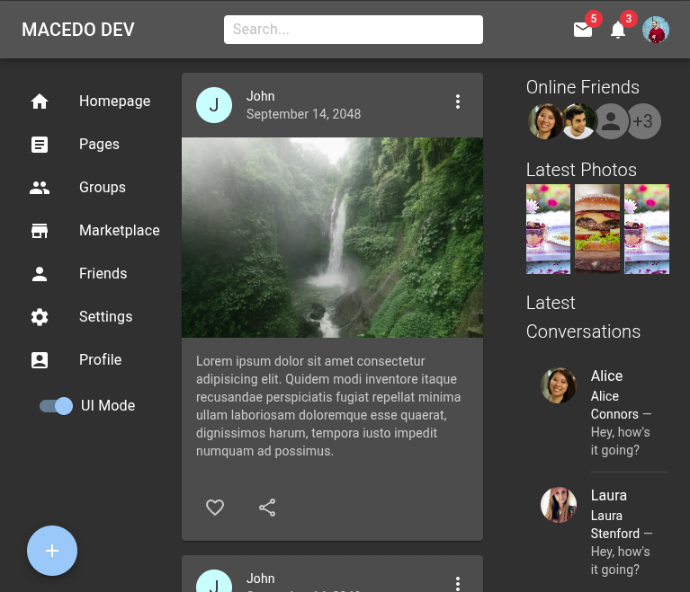
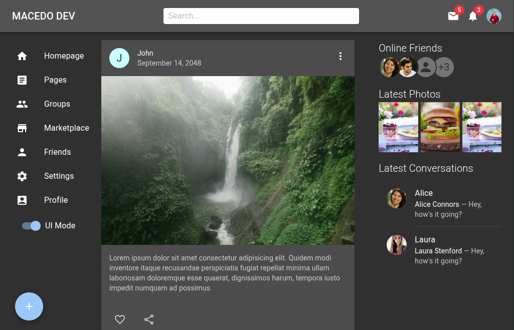

# ⚛️ Projeto Frontend: Laboratório Interativo de UI com React & MUI 🎨

## 🧪 Status do Projeto: Em Desenvolvimento Ativo (Pronto para Integração Backend)

### 💡 Propósito

Este repositório possui a interface de usuário (frontend) de uma aplicação web, construída com React e a biblioteca Material UI (MUI). O objetivo principal desse projeto é servir como um ambiente de "laboratório", permitindo a criação do backend com a finalidade de estudar novas tecnologias e modelos de desenvolvimento, testando lógicas de servidor sem a necessidade de construir uma interface gráfica do zero.

### ✨ Demonstração



### 🚀 Funcionalidades em Destaque

* **Base de Páginas Estruturada:** Possibilidade de criar novas páginas com navegação intuitiva.
* **Componentes MUI:** Utilização dos componentes, modificação de alguns com `styled components`.
* **Temas Adaptáveis:** Implementação de Light e Dark mode, com possibilidade de alteração da paleta de cores no arquivo `./src/theme/theme.js`.
* **Interação com Posts (Visual):**
	* Botões de "Like" e "Compartilhar" com feedback visual ao clique
	* Botão de "Opções de Post" presente nos posts.
* **Navegação Lateral:** Barra lateral para facilitar o acesso às páginas principais.
* **Painéis de Informação:** Sessões estáticas de "Online Friends", "Latest Photos" e "Latest Conversations" para preencher a interface.
* **Gerenciamento de Usuário Simples:** Menu de usuário acessível no canto superior direito, com opções de Perfil, Conta e Logout (estrutura visual pronta).
* **Design Responsivo:** Layout adaptável a diferentes tamanhos de tela e dispositivos.
* **Criação Rápida de Conteúdo (Futuro Backend):** Botão "+" posicionado na parte inferior esquerda para a futura funcionalidade de adicionar novos posts.

### 📸 Capturas de Tela

#### ☀️ Modo Claro


#### 🌙 Modo Escuro


#### 📱 Responsividade (Exemplo em Dispositivo Móvel [320px])



#### 📱 Responsividade (Exemplo em Dispositivo Móvel [768px])



#### 💻 Responsividade (Exemplo em Desktop [1024px])



### 🛠️ Como Começar a Integrar o Backend

#### 📦 Instalação

Siga estes passos para ter o ambiente de desenvolvimento do frontend rodando localmente:

1. **Clonar o Repositório:**
  ```bash
  git clone [https://github.com/uallace-macedo/MUI-PROJECT.git](https://github.com/uallace-macedo/MUI-PROJECT.git)
  cd MUI-PROJECT
  ```
2. **Instalar as Dependências:**
  Utilize o npm:
  ```bash
  npm install
  ```
  Ou, se preferir yarn:
  ```bash
  yarn install
  ```

#### ▶️ Executando o Frontend

Para iniciar o servidor de desenvolvimento e visualizar o frontend no seu navegador:

Com npm:
```bash
npm start
```
Ou, se preferir yarn:
```bash
yarn start
```

O frontend ficará disponível em http://localhost:5173 (ou outra porta que caso configurada).

#### ℹ️ Notas Importantes para o Desenvolvimento Backend

* Este frontend foi estruturado com foco na apresentação e interação visual. A lógica de dados e a comunicação com um servidor backend precisarão ser implementadas separadamente.
* As interações como "Like" e "Compartilhar" nos posts fornecem feedback visual através de estilos CSS, mas não realizam nenhuma chamada a uma API.
* O botão de "Opções do Post" e o botão de "+" para adicionar novos posts são elementos de interface sem funcionalidades backend associadas.
* **Observação sobre o Tema:** O tema claro/escuro é controlado localmente no frontend. Se você deseja persistir a preferência do tema do usuário entre sessões, isso precisará ser implementado no backend e sincronizado com o frontend.

### 🗺️ Próximos Passos (Roteiro para o Backend)

Como sugestões de funcionalidades backend que podem ser integradas a este frontend:

1.  **Autenticação e Autorização:** Implementar sistemas de login, registro e gerenciamento de sessões de usuário.
2.  **Gerenciamento de Posts:** Criar APIs para buscar, criar, editar e excluir posts de forma dinâmica.
3.  **Interações Sociais:** Desenvolver a lógica para registrar e exibir likes e compartilhamentos de posts, persistindo os dados no backend ao receber requisições para os endpoints..
4.  **Dados em Tempo Real:** Integrar as seções de "Online Friends" e "Latest Conversations" com dados dinâmicos através de WebSockets ou outras tecnologias, populando as respostas dos respectivos endpoints.
5.  **Gerenciamento de Perfil:** Desenvolver a funcionalidade para os usuários visualizarem e editarem seus perfis no seu endpoint específico.

### 🤝 Contribuições

Contribuições para este projeto frontend são muito bem-vindas! Se você tiver alguma sugestão de melhoria na interface, encontrar algum problema visual ou tiver alguma ideia para aprimorar a experiência do usuário (dentro do escopo de um "laboratório" de UI), sinta-se à vontade para contribuir.

Para contribuir, basta seguir os seguintes passos:

1.  **Fazer um Fork do Repositório:** Crie uma cópia deste repositório na sua própria conta do GitHub.
2.  **Crie uma Branch para sua Contribuição:** Escolha um nome descritivo para a sua branch, por exemplo, `feature/nova-melhoria` ou `fix/problema-visual`.
  ```bash
  git checkout -b sua-branch-de-contribuicao
  ```
3.  **Realize suas Modificações:** Faça as alterações e melhorias no código do frontend.
4.  **Teste suas Alterações:** Se certifique de que suas modificações não introduzam novos problemas e que a interface continue funcionando como esperado.
5.  **Faça um Commit das suas Alterações:** Adicione uma mensagem clara e concisa descrevendo as suas mudanças.
  ```bash
  git add .
  git commit -m "Adiciona melhoria na tela de perfil"
  ```
6.  **Envie suas Alterações para o seu Repositório Remoto:**
  ```bash
  git push origin sua-branch-de-contribuicao
  ```
7.  **Abra um Pull Request (PR):** Digite um título claro com uma descrição detalhada das suas contribuições.

**Diretrizes para Contribuições:**

* **Escopo da Aplicação:** As contribuições devem se manter dentro do escopo deste projeto, que é servir como um "laboratório" de interface de usuário para testes de backend.
* **Simplicidade:** Evite adicionar lógicas de negócio complexas no frontend, já que o foco principal é a estrutura e a apresentação da UI. A lógica complexa deve ser implementada no backend.
* **Pull Requests Claros:** Pull requests com descrições detalhadas e que sigam estas diretrizes terão maior probabilidade de serem aceitos.

**Agradeço qualquer contribuição que ajude a tornar este frontend ainda mais útil como base para o desenvolvimento de backends! ❤️**
